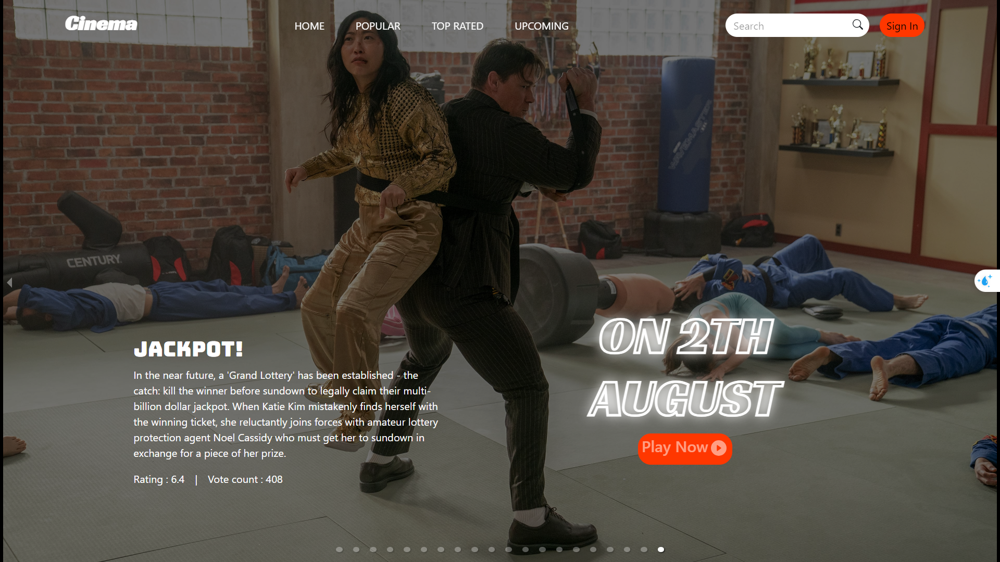
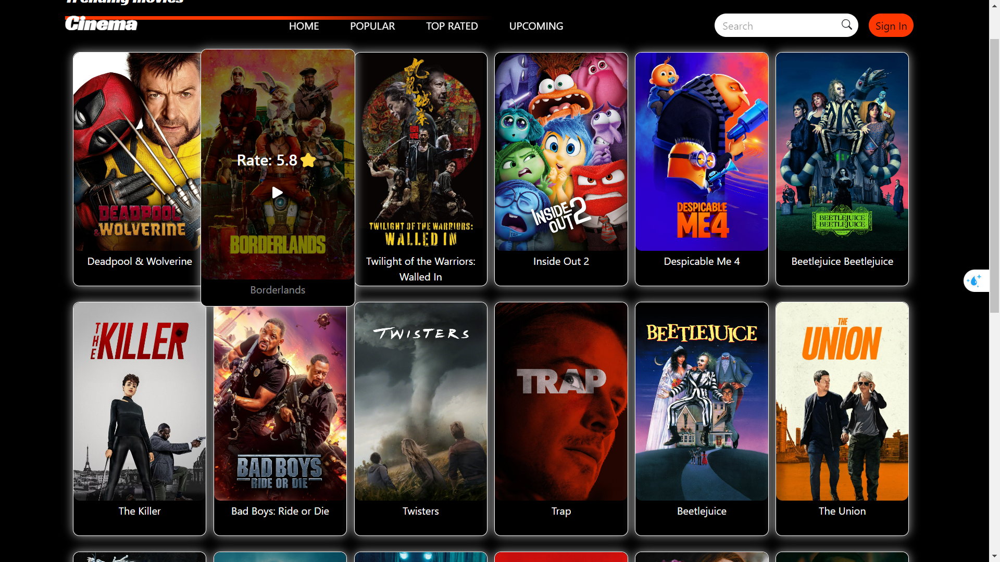

# movies-web-app
A responsive web application that allows users to search for and explore movies. This project was built using React, leveraging The Movie Database (TMDb) API for movie data. 
## Image

## Features
* List popular Movies and Tv Shows
* Search Movies and Tv Shows by title
* View details about Movies and Tv Shows including poster and trailers

## Technologies Used
* **React**: A JavaScript library for building user interfaces.
* **Bootstrap 5 and css**: Styling
* **Node.js**: JavaScript runtime built on Chrome's V8 JavaScript engine.
* **Axois**: leveraging The Movie Database (TMDb) API for movie data. 
